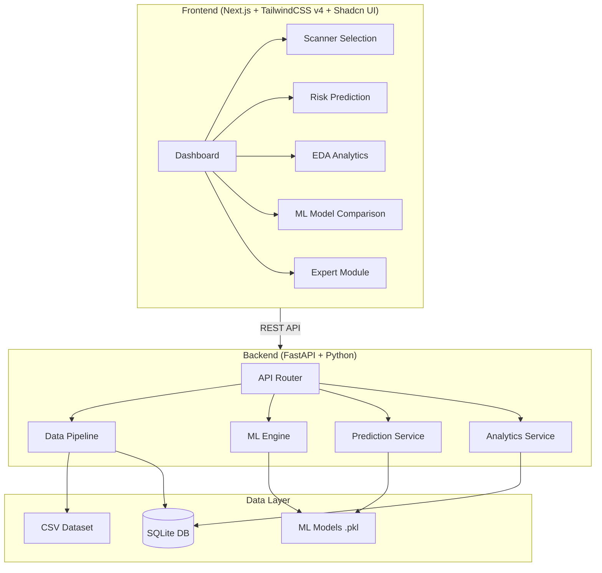

# CT Scanner Failure Risk Prediction Platform — T2S

Développement d'un système intelligent d'aide à la décision pour l'estimation du risque de panne des scanners CT (GE Optima 540) chez T2S.

## Architecture Overview



---

## User Review Required

> [!IMPORTANT]
> **SQLite** will be used instead of PostgreSQL for simpler setup, as confirmed by user. The schema will be designed to be easily migratable to PostgreSQL later.

> [!IMPORTANT]
> **TailwindCSS v4** + **pnpm** as confirmed. Shadcn UI will be initialized with the v4-compatible setup.

> [!WARNING]
> The dataset contains 663 records. This is a small dataset — cross-validation will be essential for reliable model evaluation. We'll use stratified 5-fold CV.

---

## Proposed Changes

### Phase 1: Project Structure & Setup

#### [NEW] `backend/` — FastAPI Backend

```
backend/
├── main.py                    # FastAPI app entry point
├── requirements.txt           # Python dependencies
├── config.py                  # Configuration settings
├── database.py                # SQLite connection & ORM setup
├── models/                    # SQLAlchemy models
│   └── scanner.py
├── routers/
│   ├── data.py               # Data pipeline endpoints
│   ├── analytics.py          # EDA / analytics endpoints
│   ├── ml.py                 # ML training & model comparison
│   └── prediction.py         # Risk prediction endpoints
├── services/
│   ├── data_pipeline.py      # CSV import, cleaning, feature engineering
│   ├── eda_service.py        # Exploratory data analysis
│   ├── ml_service.py         # Model training, evaluation, selection
│   ├── prediction_service.py # Risk prediction & recommendations
│   └── shap_service.py       # SHAP explainability
├── ml_models/                 # Saved trained models (.pkl)
└── data/                      # Dataset storage
    └── CT_Scanner_Dataset.csv
```

#### [NEW] `frontend/` — Next.js Frontend

```
frontend/
├── app/
│   ├── layout.tsx
│   ├── page.tsx               # Dashboard
│   ├── scanners/
│   │   └── page.tsx           # Scanner selection & history
│   ├── prediction/
│   │   └── page.tsx           # Risk prediction form
│   ├── analytics/
│   │   └── page.tsx           # EDA dashboard
│   ├── models/
│   │   └── page.tsx           # ML model comparison
│   └── expert/
│       └── page.tsx           # Expert module (component prediction)
├── components/
│   ├── layout/
│   │   ├── sidebar.tsx
│   │   ├── header.tsx
│   │   └── main-layout.tsx
│   ├── dashboard/
│   │   ├── stats-cards.tsx
│   │   ├── risk-distribution.tsx
│   │   └── recent-analyses.tsx
│   ├── prediction/
│   │   ├── prediction-form.tsx
│   │   ├── risk-result.tsx
│   │   └── recommendation.tsx
│   ├── analytics/
│   │   ├── correlation-matrix.tsx
│   │   ├── distribution-charts.tsx
│   │   └── module-breakdown.tsx
│   ├── models/
│   │   ├── model-comparison.tsx
│   │   ├── confusion-matrix.tsx
│   │   └── feature-importance.tsx
│   └── ui/                    # Shadcn UI components
├── lib/
│   ├── api.ts                 # API client
│   └── utils.ts
└── types/
    └── index.ts               # TypeScript types
```

---

### Phase 2: Backend — Data Engineering Pipeline

#### [NEW] [data_pipeline.py](file:///d:/CT_MP/backend/services/data_pipeline.py)

The data pipeline will handle:

1. **CSV Import & Validation**
   - Read CSV with pandas
   - Validate column types (numeric, categorical, date)
   - Check for nulls, duplicates, outliers (negative Maintenance_Cost)
   - Report data quality summary

2. **Data Cleaning**
   - Handle negative `Maintenance_Cost` values (clip to 0 or flag)
   - Validate `Age` ranges (1–15 reasonable)
   - Ensure `Failure_Risk` is one of {Low, Medium, High}
   - Verify `Affected_Module` categories

3. **Feature Engineering** — Create derived features:

| Feature | Logic |
|---------|-------|
| `Scanner_Age_Group` | Young (1-4), Middle (5-8), Old (9-12) |
| `Failure_Frequency_Level` | Low (0-1), Moderate (2-3), High (4+) based on `Failure_Event_Count` |
| `Maintenance_Efficiency_Score` | `MTBF / (Maintenance_Cost + 1)` normalized |
| `Downtime_Severity` | Low (<5), Moderate (5-15), High (>15) based on `Downtime` |
| `Risk_Indicator_Composite` | Weighted combination of `Failure_Rate`, `Historical_Risk_Index`, `Maintenance_Intensity` |

4. **Data Storage** — Insert cleaned & engineered data into SQLite

#### [NEW] [database.py](file:///d:/CT_MP/backend/database.py)

SQLite database with SQLAlchemy ORM:
- `scanners` table — all scanner records with features
- `predictions` table — prediction history log
- `model_metrics` table — trained model performance metrics

---

### Phase 3: Backend — Machine Learning Engine

#### [NEW] [ml_service.py](file:///d:/CT_MP/backend/services/ml_service.py)

**Training Pipeline:**
1. **Encoding**: LabelEncoder for `Affected_Module`, ordinal for target
2. **Feature Selection**: Numeric features + encoded categorical
3. **Scaling**: StandardScaler on numeric features
4. **Split**: 80/20 stratified train/test split
5. **Cross-Validation**: Stratified 5-fold CV

**Models to Train:**

| Model | Hyperparameter Tuning |
|-------|----------------------|
| Logistic Regression | C, solver, max_iter |
| Random Forest | n_estimators, max_depth, min_samples_split |
| XGBoost | n_estimators, max_depth, learning_rate, subsample |

**Evaluation Metrics** (per model):
- Accuracy, Precision (weighted), Recall (weighted), F1 Score (weighted)
- Confusion Matrix (3×3)
- Classification Report
- Cross-validation scores (mean ± std)

**Model Selection:**
- Automatic best model selection based on weighted F1 score
- Save best model + scaler + encoder as `.pkl` files

#### [NEW] [shap_service.py](file:///d:/CT_MP/backend/services/shap_service.py)

- SHAP TreeExplainer for Random Forest and XGBoost
- SHAP LinearExplainer for Logistic Regression
- Generate feature importance rankings
- Generate per-prediction SHAP explanations (why is this scanner High risk?)

---

### Phase 4: Backend — Prediction & Expert Module

#### [NEW] [prediction_service.py](file:///d:/CT_MP/backend/services/prediction_service.py)

- Load best trained model
- Accept scanner parameters → preprocess → predict
- Return: predicted class, probability distribution (Low/Medium/High %)
- Generate smart recommendations:

| Risk Level | Recommendation |
|-----------|----------------|
| Low | ✅ Continue standard monitoring. No immediate action required. |
| Medium | ⚠️ Schedule preventive maintenance within 2 weeks. Increase monitoring frequency. |
| High | 🚨 Immediate intervention recommended. Escalate to maintenance supervisor. |

- **Expert Module**: Predict most likely `Affected_Module` using a secondary classifier
  - Detector/Sensors, Console/Software, Power/Electronics, Mechanical/Gantry, Cooling/Tube, DAS/Data Acquisition, General Maintenance

---

### Phase 5: Backend — API Endpoints

#### [NEW] FastAPI Routers

| Endpoint | Method | Description |
|----------|--------|-------------|
| `/api/data/import` | POST | Import & process CSV |
| `/api/data/status` | GET | Data pipeline status |
| `/api/data/scanners` | GET | List all scanners (paginated) |
| `/api/data/scanners/{id}` | GET | Scanner detail + history |
| `/api/analytics/distribution` | GET | Risk distribution stats |
| `/api/analytics/correlations` | GET | Feature correlation matrix |
| `/api/analytics/modules` | GET | Affected module breakdown |
| `/api/analytics/summary` | GET | Dashboard summary stats |
| `/api/ml/train` | POST | Train all models |
| `/api/ml/models` | GET | Model comparison results |
| `/api/ml/best-model` | GET | Best model info |
| `/api/ml/feature-importance` | GET | Feature importance chart data |
| `/api/ml/shap/{scanner_id}` | GET | SHAP explanation for scanner |
| `/api/predict/risk` | POST | Predict risk for input data |
| `/api/predict/module` | POST | Predict affected module |
| `/api/predict/history` | GET | Prediction history |

---

### Phase 6: Frontend — Application Web

#### Design System

- **Color Palette**: Dark theme with medical/tech aesthetic
  - Primary: `#0EA5E9` (sky blue — medical tech)
  - Accent: `#F59E0B` (amber — warnings)
  - Danger: `#EF4444` (red — high risk)
  - Success: `#10B981` (green — low risk)
  - Background: `#0F172A` → `#1E293B` (slate dark gradient)
  - Cards: `rgba(30, 41, 59, 0.8)` with glassmorphism backdrop blur

- **Typography**: Inter font family
- **Effects**: Glassmorphism cards, subtle gradients, smooth transitions, micro-animations

#### Pages:

1. **Dashboard** (`/`)
   - Stats cards: Total scanners, Average risk score, High-risk count, Recent predictions
   - Risk distribution donut chart (Recharts)
   - Recent analyses table with risk badges
   - Quick action buttons

2. **Scanner Selection** (`/scanners`)
   - Searchable/filterable scanner table
   - Scanner detail cards with history (Age, Cost, Downtime, MTBF, etc.)
   - T2S-branded scanner profiles

3. **Risk Prediction** (`/prediction`)
   - Technician input form (all feature fields)
   - "Calculate Risk" button with loading animation
   - Risk result display: large gauge/meter, probability bars, color-coded level
   - Smart recommendation card with icon + action

4. **Analytics Dashboard** (`/analytics`)
   - Risk distribution bar/pie chart
   - Feature correlation heatmap
   - Module breakdown treemap/bar chart
   - Distribution histograms per feature
   - Variable importance bar chart

5. **Model Comparison** (`/models`)
   - Side-by-side model metrics table (Accuracy, Precision, Recall, F1)
   - Confusion matrices (3 models)
   - Best model highlight with badge
   - Feature importance chart
   - SHAP analysis visualization

6. **Expert Module** (`/expert`)
   - Component risk prediction
   - Module-specific analysis
   - Maintenance planning timeline

---

### Phase 7: Frontend — Component Details

#### Layout Components
- **Sidebar**: Collapsible, icon-based navigation with T2S branding
- **Header**: Breadcrumb, user info, notification bell (decorative)
- **Main Layout**: Responsive grid, smooth page transitions

#### Key UI Components
- **Risk Gauge**: Animated circular gauge (0-100%) with color gradient
- **Probability Bars**: Horizontal bars showing Low/Medium/High %
- **Confusion Matrix Heatmap**: Interactive grid with color intensity
- **Feature Importance**: Horizontal bar chart sorted by importance
- **Correlation Matrix**: Color-coded heatmap grid
- **Scanner Card**: Compact card with key metrics & risk badge

---

## Verification Plan

### Automated Tests
```bash
# Backend
cd backend
python -m pytest tests/ -v

# Frontend
cd frontend
pnpm lint
pnpm build
```

### Manual Verification
1. **Data Pipeline**: Import CSV → verify 663 records loaded, features engineered correctly
2. **ML Training**: Train 3 models → verify metrics > 80% accuracy
3. **Prediction**: Submit scanner data → verify risk prediction with probabilities
4. **UI**: Navigate all pages → verify charts render, forms work, responsive design
5. **SHAP**: View SHAP explanations → verify feature contributions displayed
6. **Expert Module**: Predict affected module → verify component prediction

### Integration Testing
1. Start backend (`uvicorn main:app --reload`)
2. Start frontend (`pnpm dev`)
3. Full workflow: Import data → Train models → Make predictions → View analytics

---

## Implementation Order

| Step | Component | Description | Priority |
|------|-----------|-------------|----------|
| 1 | Backend Setup | Project structure, dependencies, database | 🔴 Critical |
| 2 | Data Pipeline | CSV import, cleaning, feature engineering | 🔴 Critical |
| 3 | ML Engine | Model training, evaluation, comparison | 🔴 Critical |
| 4 | Prediction API | Risk prediction + recommendations | 🔴 Critical |
| 5 | SHAP Analysis | Model explainability | 🟡 Important |
| 6 | Expert Module API | Affected module prediction | 🟡 Important |
| 7 | Frontend Setup | Next.js + Tailwind v4 + Shadcn UI | 🔴 Critical |
| 8 | Dashboard Page | Main dashboard with stats & charts | 🔴 Critical |
| 9 | Scanner Page | Scanner list & detail | 🟡 Important |
| 10 | Prediction Page | Technician form + risk result | 🔴 Critical |
| 11 | Analytics Page | EDA charts & visualizations | 🟡 Important |
| 12 | Models Page | ML comparison & confusion matrices | 🟡 Important |
| 13 | Expert Page | Component prediction module | 🟢 Bonus |
| 14 | Polish & Integration | Animations, responsive, final testing | 🟡 Important |

---

## Open Questions

> [!IMPORTANT]
> **Branding**: Should I use a specific T2S logo, or should I create a mock T2S × Scanner Risk logo for the application?

> [!NOTE]
> **Authentication**: The spec mentions technicians and maintenance managers. Should I add a mock login page (decorative, no real auth) to make it look more professional for the PFE presentation?

> [!NOTE]
> **Language**: Should the UI be in French or English? The spec uses both. I'll default to **English** for the UI with French labels where appropriate (e.g., "Calculer le risque").
